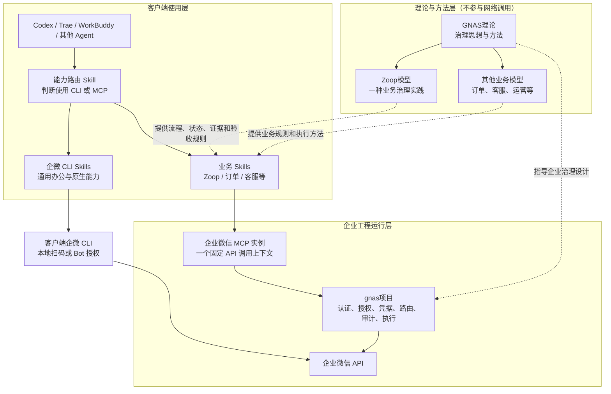

# 企业微信 MCP 最终能力模型与边界

> 状态：最终方案（架构定稿）
> 定稿日期：2026-08-18
> 适用项目：`wecom-mcp`、`ginkgoto-ai/gnas-service-gin`、`ginkgoto-ai/gnas-node`
> 核心原则：客户端通用能力与企业级受治理能力平行互补；业务编排、协议转发和服务端授权各自只保留一份职责。

## 1. 最终结论

本项目最终采用以下能力模型：

1. **企微 CLI 是客户端通用能力路径**：由 Codex、Trae、WorkBuddy 等客户端通过企微 CLI Skills 使用，适合通用办公、个人操作、临时查询和企微原生能力探索。
2. **企业微信 MCP 是企业级受治理能力入口**：一个 MCP 实例固定绑定一个企业微信 API 调用上下文，通过 `gnas项目`长期稳定地访问企业微信。
3. **`gnas项目`是企业业务与基础能力之间的运行桥梁**：集中负责身份认证、API 授权、企业凭据、Source 路由、接口转发和审计。
4. **业务模型主要由 Skill 表达**：Zoop、订单、客服等 Skill 负责告诉 AI 要做什么、按什么流程做以及如何验收。
5. **MCP 不再维护重复的业务 API 白名单**：API 级授权集中在 `gnas项目`，MCP 只做受约束的协议转发和输入输出保护。
6. **Skill 不是安全边界**：Skill 可以指导调用，但不能阻止绕过；不可绕过的接口授权和关键业务约束必须由服务端执行。
7. **企微 CLI 与企业级 MCP 不做运行时深度集成**：MCP 不启动 CLI 子进程，`gnas项目`不依赖客户端 CLI 凭据，两条路径只在客户端 Skill 使用层互补。

一句话定义：

> 企微 CLI 回答“客户端现在能直接使用哪些企业微信能力”；业务 Skill 回答“为了业务目标应该怎么做”；MCP 提供稳定的 AI 协议入口；`gnas项目`决定“这个调用方能以哪套企业身份调用哪些企业微信 API”，并完成真实执行和审计。

## 2. 术语统一

为避免 `GNAS` 二义性，文档和后续沟通统一使用以下名称：

| 统一名称 | 可用别名 | 定义 |
|---|---|---|
| `gnas项目` | `GNAS Runtime`、GNAS 工程实现 | `ginkgoto-ai` 中的 `gnas-service-gin` 和 `gnas-node` 两个运行模块 |
| `GNAS理论` | `GNAS Governance Framework`、GNAS 治理理论 | 与 Zoop 一起讨论的理论、组织和治理框架，不是一个可调用服务 |
| `Zoop模型` | Zoop 实践模型 | `GNAS理论`指导下的一种业务治理实践，不局限于软件项目管理 |
| `wecom-mcp` | 企业微信 MCP | 面向 AI 客户端提供企业微信受治理能力的 MCP 协议适配项目 |
| 企微 CLI | `wecom-cli` | 企业微信官方客户端命令行能力及配套 Skills |

不再单独使用含义不明确的 `GNAS`。如果上下文不能确定其含义，应明确写成 `gnas项目`或 `GNAS理论`。

## 3. 最终总体架构

### 3.1 理论指导面与工程运行面



这张图包含两条互补执行路径：

- **客户端通用路径**：Agent → 企微 CLI Skill → 本地企微 CLI → 企业微信。
- **企业受治理路径**：Agent → 业务 Skill → 企业微信 MCP → `gnas项目` → 企业微信。

两条路径共享企业微信这个能力终点，但不共享运行时、凭据或授权状态。

### 3.2 两条路径的边界

| 对比项 | 企微 CLI 路径 | MCP＋`gnas项目`路径 |
|---|---|---|
| 运行位置 | Agent 所在客户端 | 企业长期运行环境 |
| 授权身份 | 本地扫码或 Bot 授权 | `gnas项目`管理的服务应用和企业凭据 |
| 主要用途 | 通用办公、个人任务、临时查询、能力探索 | 企业业务、关键写入、批量执行、审计与持续运行 |
| 业务流程 | 由客户端 Skill 指导 | 由业务 Skill 指导，服务端执行不可绕过的约束 |
| API 授权 | 企业微信对本地身份的权限 | `gnas项目`权限＋企业微信上游权限 |
| 审计 | 本地及企业微信原生日志 | `gnas项目`统一请求 ID 和企业审计 |
| 与另一条路径的关系 | 补充通用和长尾能力 | 承载正式企业业务能力 |

## 4. 一个 MCP 实例的边界

一个 MCP 实例固定对应一个企业微信 API 调用上下文：

```text
MCP 实例
+ 固定的 gnas项目地址
+ 固定的服务应用身份
+ 固定的企业微信 Source / tenant_route
+ 固定的企业微信凭据引用（由 gnas项目管理）
+ gnas项目为该服务应用授予的 API 权限
```

调用方不得在单次工具调用中改变：

- `gnas项目`地址；
- 企业或自建应用；
- Source、tenant route 或凭据引用；
- access token、Secret、Authorization 或上游 Host。

一个 MCP 实例可以被多个业务 Skill 复用：

```text
企业微信 MCP 实例 A
├── Zoop Skill
├── 订单运营 Skill
└── 客服 Skill
```

这里的“多个业务模型”不再表示把多套业务状态机硬编码进 MCP，而是表示多套业务 Skill 可以通过同一个受治理实例使用其被授予的能力。

不同企业、不同自建应用或不同权限边界仍应使用不同 MCP 配置实例。代码可以共用，授权上下文不能在一次调用中动态切换。

## 5. 各层最终职责

| 层 | 必须负责 | 明确不负责 |
|---|---|---|
| 能力路由 Skill | 判断使用企微 CLI 还是企业级 MCP；给出使用示例 | 不签发权限，不阻止直接调用 |
| 业务 Skill | 业务目标、步骤、状态、字段含义、证据、恢复和验收 | 不保存企业凭据，不充当服务端授权点 |
| 企业微信 MCP | MCP 协议、工具 Schema、参数校验、固定路由、请求 ID、超时、错误转换、响应裁剪 | 不维护业务 API 白名单，不承载 Zoop 状态机，不启动企微 CLI |
| `gnas项目` | 调用方认证、Source/Method/Path 授权、凭据管理、接口转发、审计、限流和服务可用性 | 不负责用提示词教 AI 完成业务流程 |
| 企业微信 | 应用权限、可见范围、文档和数据资源权限 | 不理解 Zoop 等上层业务治理语义 |

## 6. API 白名单最终方案

### 6.1 最终决定

MCP 不再保留按业务模型分组的 `api_whitelist`。系统只保留一个不可绕过的 API 授权执行点：`gnas项目`。

授权最小判定维度为：

```text
调用方服务应用
+ 企业微信 Source
+ HTTP Method
+ 企业微信相对 Path
+ 可选资源范围与业务约束
```

认证与授权必须区分：

- **认证**回答“调用方是谁”；
- **授权**回答“该调用方是否可以调用这个 Source 的这个 Method＋Path”。

仅验证 `app_id/app_secret`并签发 JWT 不等于完成授权。

### 6.2 Skill 为什么不能代替授权

Skill 是行为指导，不是安全边界。以下情况都可以绕过 Skill：

- 模型理解错误或 Prompt Injection；
- 用户直接调用 MCP 工具；
- 使用另一个 MCP 客户端构造请求；
- Skill 未安装、被修改或版本过期；
- 自动化程序直接访问 MCP 或 `gnas项目`。

因此：

> Skill 可以声明“正常情况下应该调用什么”，只有 `gnas项目`能够强制执行“实际上允许调用什么”。

### 6.3 MCP 仍需保留的安全控制

删除业务 API 白名单不等于将 MCP 变成无约束透明代理。MCP 仍必须：

- 只允许固定 `gnas项目`地址和固定 Source；
- 拒绝调用方提供租户、Host、凭据和 Authorization；
- 只接受规范化的 Method、相对 Path 和结构化 Payload；
- 校验工具输入 Schema、请求体大小和响应体大小；
- 设置连接和调用超时；
- 生成并传递请求 ID；
- 对错误和响应进行结构化转换；
- 清除敏感响应头和敏感字段；
- 对不确定的写入结果失败关闭，不盲目重试。

这些属于代理安全、租户隔离和协议稳定性，不属于业务 API 白名单。

## 7. Zoop 与业务模型的最终位置

Zoop 是 `GNAS理论`指导下的一种业务治理实践，负责定义：

- 业务主体和角色；
- 需求、任务和业务对象；
- 状态、流程和责任边界；
- 证据、回读和验收；
- 失败停止、恢复和人工交接。

Zoop 的主要交付形态是 `Zoop Skill`及其数据契约。Zoop Skill 调用企业微信 MCP，但 Zoop 不等于 MCP，也不决定 MCP 连接哪一家企业微信。

对于不可被绕过的关键规则，例如资金动作、关键状态迁移、管理员操作或需要人工确认的写入，不能只写在 Skill 中，应在 `gnas项目`提供受管业务端点或服务端校验。

## 8. 企微 CLI 的互补规则

企微 CLI 不嵌入 MCP，也不运行在 `gnas项目`内部。推荐路由如下：

| 使用场景 | 推荐路径 |
|---|---|
| 查询个人日程、创建个人待办 | 企微 CLI Skill |
| 临时查询文档或验证企微新能力 | 企微 CLI Skill |
| 查询 Zoop 需求和任务 | Zoop Skill → MCP → `gnas项目` |
| 修改 Zoop 状态或批量写入业务表 | Zoop Skill → MCP → `gnas项目` |
| 受审计的企业流程和长期自动化 | 业务 Skill → MCP → `gnas项目` |
| 官方能力探索和故障对照 | 企微 CLI，必要时与 MCP 结果对比 |

必须特别防止“用 CLI 绕过企业治理”：

- 正式业务资源应优先通过企业微信权限限制，只允许 `gnas项目`持有的应用身份执行关键写入；
- 客户端 CLI 身份应限制为个人资源、通用资源或只读范围；
- 如果 CLI 身份和 `gnas项目`身份都能修改同一受治理资源，那么 Skill 无法提供强制隔离，系统仍存在治理旁路。

因此，两条路径可以不深度集成，但必须通过企业微信原生权限和资源范围实现真实隔离。

## 9. 当前实现与目标方案的差距

| 项目 | 当前实现 | 最终目标 |
|---|---|---|
| MCP API 白名单 | `internal/config/config.go`要求实例 `api_whitelist` | 验证 `gnas项目`授权后删除重复业务白名单 |
| API 操作表 | `internal/wecom/client.go`维护静态 Operations | 可保留为能力目录和路径映射，但不再作为最终授权依据 |
| 通用 API 工具 | MCP 同时检查读写类型和实例白名单 | MCP 做结构校验，最终权限由 `gnas项目`返回允许或 `403` |
| Zoop 实现 | 部分流程和管理逻辑位于 `internal/mcp` | 普通编排迁移到 Zoop Skill；不可绕过约束进入受管服务端能力 |
| `gnas项目`授权 | 已有按服务应用、Source、Method、Path 授权的 Token Broker 基础 | 成为企业微信调用的唯一权威授权点 |
| 企微 CLI | 未进入本项目运行链 | 保持客户端独立路径，只提供 Skill 和示例层互补 |

## 10. 取消 MCP 白名单的前置验收

在代码中删除 `api_whitelist`之前，必须完成以下验收：

1. 当前 MCP 的每个固定 `tenant_route`或 Source 都通过 `gnas项目`受管 Token Broker 路径执行。
2. `gnas项目`能够从服务 JWT 得到唯一服务应用身份。
3. 服务应用权限能精确约束 Source、Method 和 Path。
4. 未授权 Source、Method、Path 均在到达企业微信前返回 `403`。
5. MCP 调用方不能注入 Source、Host、凭据、Authorization 或 access token。
6. 允许调用、拒绝调用和跨 Source 越权均有自动化测试。
7. 审计日志能关联服务应用、Source、Method、Path、状态码和请求 ID。
8. 生产配置经过只读回查，确认不存在允许所有 Path 的非预期通配授权。

只有以上条件全部成立，才能删除 MCP 中重复的业务 API 白名单。否则应继续失败关闭。

## 11. 最终设计原则

1. **一处授权**：企业微信 API 授权只在 `gnas项目`强制执行。
2. **Skill 管方法，不管权限**：Skill 负责告诉 AI 怎么做，不承担安全责任。
3. **MCP 保持薄层**：只做协议、校验、固定路由和安全代理。
4. **一个实例一个调用上下文**：企业、应用、Source 和凭据边界固定，不由工具参数切换。
5. **业务模型可复用**：多个业务 Skill 可以复用同一个 MCP 实例，同一个 Skill 也可以连接不同实例。
6. **CLI 与 MCP 平行互补**：不共享运行时，不建立内部调用依赖。
7. **关键约束必须服务端化**：不可绕过的业务规则不能只存在于 Skill。
8. **权限最小化**：CLI 身份、MCP 服务应用和企业微信资源权限分别按最小范围配置。
9. **写入必须可证明**：关键写入需要幂等、回读、审计和不确定状态失败关闭。
10. **先验收再简化**：确认 `gnas项目`授权链有效后，才删除 MCP 的重复白名单。

## 12. 定稿依据

本方案基于以下可验证事实，而不是仅按概念推导：

- 企微 CLI 官方快速开始要求在 Agent 所在环境安装 CLI 和 Skills，并完成一次本地授权；凭据保存在本地配置目录。因此将其定义为客户端通用能力路径，而不是 `gnas项目`的必选服务端组件。参见[企微 CLI 官方仓库](https://github.com/WecomTeam/wecom-cli)和[CLI 命令参考](https://github.com/WecomTeam/wecom-cli/blob/main/docs/cli-reference.md)。
- MCP 官方授权规范区分无效身份与权限不足，并要求服务端验证访问令牌和资源范围；工具集合也可以随调用方授权范围变化。因此 Skill 或 `tools/list`不能代替服务端授权。参见[MCP Authorization](https://modelcontextprotocol.io/specification/2025-06-18/basic/authorization)和[MCP Tools](https://modelcontextprotocol.io/specification/draft/server/tools)。
- 当前 MCP 在 [`internal/config/config.go`](internal/config/config.go)、[`internal/mcp/generic_api.go`](internal/mcp/generic_api.go)和[`internal/wecom/client.go`](internal/wecom/client.go)重复维护 API 白名单、读写限制和操作映射。
- `gnas项目`的 [`ManagedTokenBroker.go`](../ginkgoto-ai/gnas-service-gin/service/ManagedTokenBroker.go)已经具备按服务应用、Source、Method 和 Path 判定权限的基础，适合作为唯一权威授权点。
- 当前 MCP 是否已经对所有 Source 使用该授权链仍需要部署级验收，所以本文明确规定“先验证、再删除重复白名单”，不把代码能力等同于生产生效。

## 13. 最终能力模型

```text
GNAS理论
├── Zoop模型
└── 其他业务模型
        ↓ 形成业务 Skills

客户端 Agent
├── 企微 CLI Skills → 本地企微 CLI → 企业微信通用能力
└── 业务 Skills → 企业微信 MCP → gnas项目 → 企业微信受治理能力

安全边界
├── Skill：行为指导
├── MCP：固定实例和安全代理
├── gnas项目：身份、API授权、凭据、路由、审计
└── 企业微信：应用、资源和数据权限
```

最终项目定位：

> `wecom-mcp`不是企微 CLI 的服务端封装，也不是 Zoop 专用 MCP；它是连接 AI 客户端与 `gnas项目`的轻量企业微信协议适配层。通用企微能力由客户端 CLI Skills 补充，业务方法由 Zoop 等 Skills 定义，企业级授权和真实执行由 `gnas项目`统一完成。
