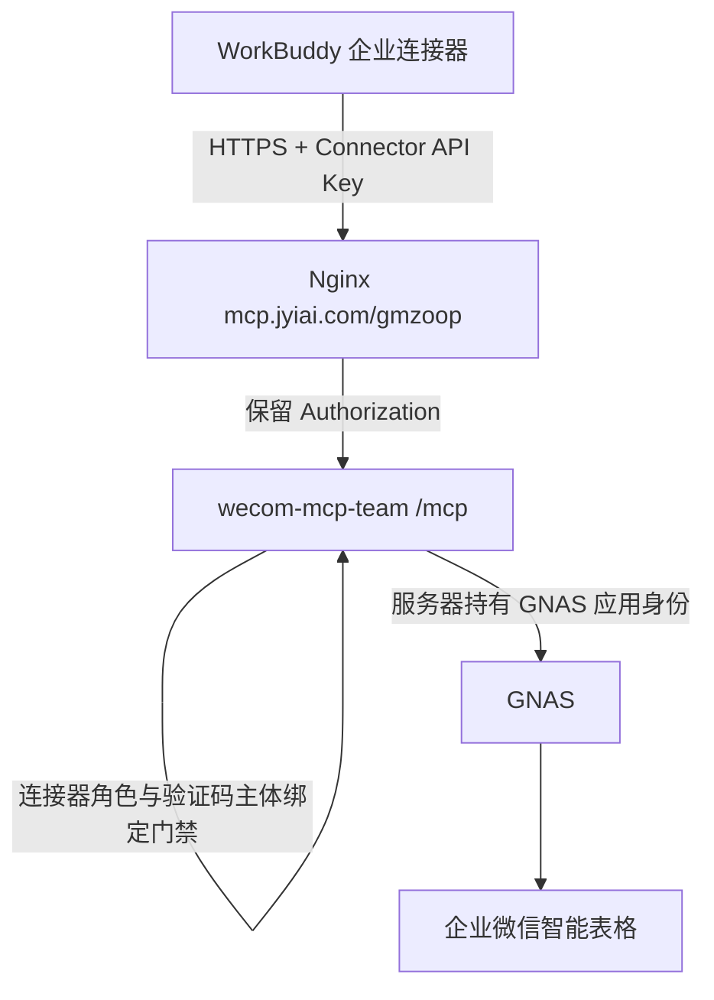

# 国脉爱特团队 MCP 服务器

本模块把现有固定租户企业微信业务层发布为团队可共享的 Streamable HTTP MCP，同时保留仓库根模块原有的 stdio 二进制和 Go 1.23 构建契约。团队服务器使用 Go 1.25 和官方 MCP Go SDK，不改变客户端本地安装器。

## 边界



- 默认部署使用 WorkBuddy 企业自定义连接器的 API Key；MCP 只接受 `Authorization: Bearer <connector-key>`。`TEAM_MCP_CONNECTOR_ROLE` 显式配置为 `reader`、`operator` 或 `admin`，默认 `reader`；它仍不能读取或推断当前 WorkBuddy 成员身份。
- 国脉爱特的 `GNAS_APP_ID` / `GNAS_APP_SECRET` 只存在于服务器 Secret 或受保护环境文件。
- `reader`、`operator`、`admin` 角色逐层继承；`tools/list` 只展示已授权工具，`tools/call` 再次校验。
- 现有固定租户、API 白名单、Schema、幂等、写后回读和初始化恢复门禁仍是最终业务边界。
- 审计日志只记录请求 ID、角色、工具、结果、耗时和 HMAC 密钥化的主体假名，不记录 Token、Secret、业务参数或响应内容；审计密钥按 PII/Secret 管理。
- 应用层默认最多同时执行 16 个业务工具调用，可通过受控配置调低或调高；公网速率限制仍由组织 API Gateway/WAF 提供。

## WorkBuddy Connector API Key 测试模式

当前 `deploy/gmzoop.env.example` 是固定连接器模式：在 WorkBuddy 企业后台创建自定义连接器，认证方式选择 **API Key**，Header Name 填 `Authorization`，Header Value 填 `Bearer <与服务器受保护环境相同的值>`，MCP Server URL 填 `https://mcp.jyiai.com/gmzoop/mcp`。示例把 `TEAM_MCP_CONNECTOR_ROLE` 设为 `admin`，暴露当前二进制实现的全部 MCP 工具；不发布 OAuth metadata，且拒绝同时启用 `TEAM_MCP_USER_AUTHZ_ENABLED=true`。固定租户、Schema、幂等、写后回读和 API 白名单继续生效。

这是连接器服务身份，不是用户登录或逐人授权。它不能写入 Zoop 的“需求提出主体”等业务字段。operator/admin 工具必须另外提供永久 `identity_binding_id`：首次使用时，WorkBuddy 询问企业微信通讯录完整姓名，`wecom_identity_binding_start` 唯一匹配启用成员与 Z-S09 主体，并由自建应用向该成员发送 6 位验证码；`wecom_identity_binding_confirm` 验证成功后生成绑定。验证码一次性、最多输错 5 次；绑定本身不设有效期，并支持持有原句柄时换绑。

绑定句柄只解决当前业务操作由谁发起，不会把共享 Connector API Key 升格为逐用户访问授权。实例配置中的 `ai_execution_subject_record_id` 固定指向一个已登记且启用的 Z-S09 WorkBuddy AI 执行主体；缺失时团队 operator/admin 调用失败关闭。`wecom_record_apply` 新建记录时自动注入双主体：Z-S01/Z-S02 使用人员发起者，Z-S04/Z-S05 使用 AI 执行者，Z-S06 同时填写发起者与执行者；显式提交冲突主体会被拒绝。Z-S03 的责任与执行主体由治理流程按实际分工显式填写。

## OIDC / 用户授权候选边界

启用 `TEAM_MCP_AUTH_MODE=oidc` 后，可使用 `TEAM_MCP_USER_AUTHZ_ENABLED` 门禁和与 GNAS 存储实现解耦的 `AuthorizationResolver`。它从同一组 `GNAS_BASE_URL`、`GNAS_APP_ID`、`GNAS_APP_SECRET` 推导两个固定 GNAS 服务地址并取得短期 Service JWT，不再重复配置第二组应用凭据。`app_info` 仍是应用身份和服务路由授权的权威来源；逐用户 MCP 工具授权仍由 `mcp_user_authorizations` 经 `ResolveAuthorizationV1` 返回，二者不能互相替代。

门禁开启后，MCP 必须取得唯一、大小写敏感的企业微信 `userid`，并以固定 `tenant + userid + resource` 查询授权。归一化决策包含 `active`、`effective_tools`、`effective_scopes`、`policy_version`；`tools=["*"]` 只展开为当前二进制公开的工具目录，且继续与静态 reader/operator/admin 角色取交集。`tools/list` 过滤发现列表，`tools/call` 在每次 HTTP 请求重新执行同一授权边界。

以下情况全部失败关闭：userid 或 GNAS 签名 `principal_assertion` 缺失/歧义、active=false、scope 缺失、未知工具、响应结构漂移、GNAS 错误码不匹配、两秒超时、策略版本缺失。授权正向和拒绝结果均不缓存；每次 `tools/list`、`tools/call` 都实时获取短期 Service JWT 并调用 ResolveAuthorizationV1，撤权在下一请求生效。审计仅增加授权结果和 `policy_version`，不记录 userid、Token、Secret、身份断言或授权响应原文。

feature flag 开启时，MCP 从 `GNAS_BASE_URL` 推导同源的 Service JWT 与 resolver HTTPS URL，并复用 `GNAS_APP_ID` / `GNAS_APP_SECRET`；仍必须提供经核验的 GNAS tenant key、OAuth Token 中的企业微信 userid claim 与 GNAS 签名 assertion claim。缺任一项即拒绝启动或拒绝请求。回滚边界是关闭 feature flag 并重启候选服务，恢复既有静态 OIDC 角色路径，不改实例配置、Schema、GNAS 数据或企业微信资产。候选合同与测试说明见 [`AUTHORIZATION-CANDIDATE.md`](AUTHORIZATION-CANDIDATE.md)。

## HTTP 端点

| 端点 | 认证 | 用途 |
| --- | --- | --- |
| `POST /mcp` | Connector API Key 或 OIDC Bearer Token | 官方 Streamable HTTP MCP；JSON 或客户端声明的标准响应 |
| `GET /.well-known/oauth-protected-resource` | 无 | 仅 OIDC 模式提供 RFC 9728 OAuth 资源发现 |
| `GET /healthz` | 无 | 进程存活检查，不访问 GNAS |
| `GET /readyz` | 无 | 实例配置、Schema 和 GNAS 环境结构检查；不访问远端或返回租户信息 |

生产只应通过 HTTPS 反向代理暴露。本轮唯一实例 gmzoop 监听 `127.0.0.1:7702`，公网基址为 `https://mcp.jyiai.com/gmzoop`；Nginx strip `/gmzoop` 后转发到内部根端点。`127.0.0.1:7701` 已被现有服务占用，禁止使用；本轮不配置其他实例。

## OIDC 约定

OIDC 访问令牌必须满足：

- 签名、签发方、有效期由 OIDC discovery/JWKS 校验；
- `aud` 包含 `TEAM_MCP_OIDC_AUDIENCE`；
- 稳定、非空的 `sub` 用于成员审计；
- `TEAM_MCP_ACCESS_TOKEN_CLAIM` 必须精确包含 `TEAM_MCP_ACCESS_TOKEN_VALUE`，用来区分 access token 与 ID token；
- `TEAM_MCP_ROLES_CLAIM` 指定的 claim 至少包含一个已配置角色；
- 可选 `TEAM_MCP_REQUIRED_SCOPES` 全部存在。

默认角色值：

| OIDC 角色 | MCP 角色 | 能力 |
| --- | --- | --- |
| `wecom-mcp-reader` | reader | 查询记录、Schema/初始化状态等只读工具 |
| `wecom-mcp-operator` | operator | reader + 受控记录写入和进度重算 |
| `wecom-mcp-admin` | admin | 全部工具，包括初始化、Schema 迁移和通用受管 API |

`wecom_send_app_message` 属于 operator 能力。它只允许向一个当前员工目录中的启用 `userid` 发送
文本消息，禁止 `@all`；`agentid` 由 GNAS 从受保护的自建应用凭据注入。调用必须提供稳定幂等键，
仅在企业微信返回有效 `msgid` 后标记完成。

身份绑定工具为 `wecom_identity_binding_start`、`wecom_identity_binding_confirm`、
`wecom_identity_binding_status`。服务器只持久化验证码 HMAC 摘要和绑定句柄的 SHA-256 查找键，
不保存或返回验证码原文；状态文件以 0600 原子写入实例 data 目录。

角色和 access-token 类型 claim 支持点路径，例如 `realm_access.roles`。OIDC 提供方必须签发 JWT access token，并提供标准 discovery/JWKS；部署前必须按该 IdP 的真实 access-token claim 设置 discriminator。ID token、本地自签共享 Token、空 `sub` 均默认拒绝。

## 本地构建与测试

根模块仍使用 Go 1.23，团队模块单独使用 Go 1.25：

```sh
go test ./...

cd teamserver
go test ./...
go test -race ./...
go vet ./...
go build ./cmd/wecom-mcp-team
```

## 服务器部署

1. 创建无登录系统用户/组 `wecom-mcp-gmzoop`。共享程序版本只放入 `/home/product/services/mcp/wecom/releases/<version>/wecom-mcp-team`，`/home/product/services/mcp/wecom/current` 是指向选定版本的原子符号链接。
2. gmzoop 实例只使用 `/home/product/services/mcp/wecom/instances/gmzoop/config` 与 `/home/product/services/mcp/wecom/instances/gmzoop/data`。config 只读，Schema generation、journal 和其他运行状态写入 data。实例配置中的绝对路径必须对应这些真实路径；`schema_admin_user` 必须受控更新为服务器进程用户 `wecom-mcp-gmzoop`，OIDC admin 不替代 OS 身份门禁。
3. 将 `deploy/gmzoop.env.example` 审阅后写为 `/etc/wecom-mcp/gmzoop.env`，属主 root:root、权限 0600；通过服务器 Secret 管理注入 GNAS 与审计密钥。Secret 不得进入项目目录、Git、镜像或日志。
4. 将 `deploy/wecom-mcp@.service.example` 审阅后安装为 `/etc/systemd/system/wecom-mcp@.service`，只启用 `wecom-mcp@gmzoop.service`。日志使用 journald。
5. 使用项目交付包中的独立 `nginx-mcp.jyiai.com-gmzoop.conf`；只暴露 `/gmzoop` 精确路由，保留 `Authorization` 和流式响应，并把 upstream `Host` 固定为 `127.0.0.1:7702` 以保留 SDK DNS-rebinding 防护。不得覆盖既有站点。
6. API Key 测试模式下，在服务器执行交付包的 `create-gmzoop-env.sh /etc/wecom-mcp/gmzoop.env`；脚本在服务器本地生成 Connector Key 与审计 Key，随后由 Secret 管理注入 GNAS App ID/Secret。不要把生成的 Key 写入 Git、压缩包或聊天。
7. 先验证 `/healthz`、`/readyz` 和未认证 `/mcp` 的 `401`，再在 WorkBuddy 企业自定义连接器中配置 `Authorization: Bearer <Connector Key>`，执行 `initialize`、`tools/list` 和一个只读工具调用。

systemd 模板把 `/home/product/services/mcp/wecom` 设为只读，仅允许当前实例写入 `instances/%i/data`；源码目录、共享 release、实例 config 和其他实例目录均不可写。

## WorkBuddy 配置

优先在 WorkBuddy 的团队 MCP 管理界面添加远程 MCP：

```json
{
  "mcpServers": {
    "guomai-aite-wecom": {
      "type": "http",
      "url": "https://mcp.jyiai.com/gmzoop/mcp"
    }
  }
}
```

不要在配置中填写 GNAS Secret。当前 API Key 测试模式不走 OAuth：在企业自定义连接器中选择 API Key，将 Header Name 设为 `Authorization`、Header Value 设为 `Bearer <Connector Key>`。腾讯云 MCP 市场模板可能显示 `transportType: "streamable-http"`；WorkBuddy 当前 HTTP 配置契约使用 `type: "http"`。不同 WorkBuddy 版本若使用 UI 而非 JSON，以该版本官方界面生成的配置为准，不直接覆盖内部文件。

## WorkBuddy Zoop Skill

项目级治理 Skill 位于 [`.codebuddy/skills/zoop-workbuddy-governance`](../.codebuddy/skills/zoop-workbuddy-governance/SKILL.md)。WorkBuddy 支持从本地技能包导入，也会优先发现工作区 `.codebuddy/skills/` 下的项目 Skill。该 Skill 负责九表路由、状态机、人员发起者与 AI 执行者分离、去重、独立验证/Review、三次受控恢复与人工升级；MCP 继续负责不可绕过的身份、Schema、capability、幂等和回读门禁。

安装后在同一 WorkBuddy 任务中启用 `zoop-workbuddy-governance` 与 gmzoop MCP。首次 operator/admin 操作先完成企业微信验证码绑定；不得把 Skill、连接器 API Key 或工具可见性当成用户授权。

## 验收层级

必须分别报告：

```ini
built=yes|no
server_installed=yes|no
server_configured=yes|no
https_reachable=yes|no
oauth_verified=yes|no
loaded=yes|no
role_filter_verified=yes|no
registry_verified=yes|no
nine_tables_verified=yes|no
schema_synced=yes|no
tools_call_verified=yes|no
workbuddy_verified=yes|no
owner_accepted=no
production_deployed=no
```

本地测试、静态构建或 HTTP 200 不能替代真实 WorkBuddy OAuth 登录和固定租户只读调用。

## 回滚

- 保留上一个 `/home/product/services/mcp/wecom/releases/<version>/` 不可变二进制及其校验和。
- 回滚只切换程序版本，不覆盖实例配置、Schema、journal 或 GNAS 凭据。
- 在 Linux 上创建指向目标 release 的 `current.next` 链接，再以同一文件系统内的原子 rename 替换 `/home/product/services/mcp/wecom/current`，随后 `systemctl restart wecom-mcp@gmzoop`；不要原地覆盖正在运行的二进制。
- 切换后依次回读 `/healthz`、`/readyz`、OAuth、`initialize`、角色化 `tools/list` 和只读工具。
- 未确认的企业微信远程写入按现有 journal/sentinel 恢复，禁止因程序回滚而盲目重放。

## 参考

- [WorkBuddy MCP Integration](https://www.workbuddy.ai/docs/workbuddy/From-Beginner-to-Expert-Guide/Function-Description/MCP-Guide)
- [WorkBuddy Enterprise MCP 配置](https://cloud.tencent.com/document/product/1831/137039)
- [MCP 官方 Go SDK](https://github.com/modelcontextprotocol/go-sdk)
