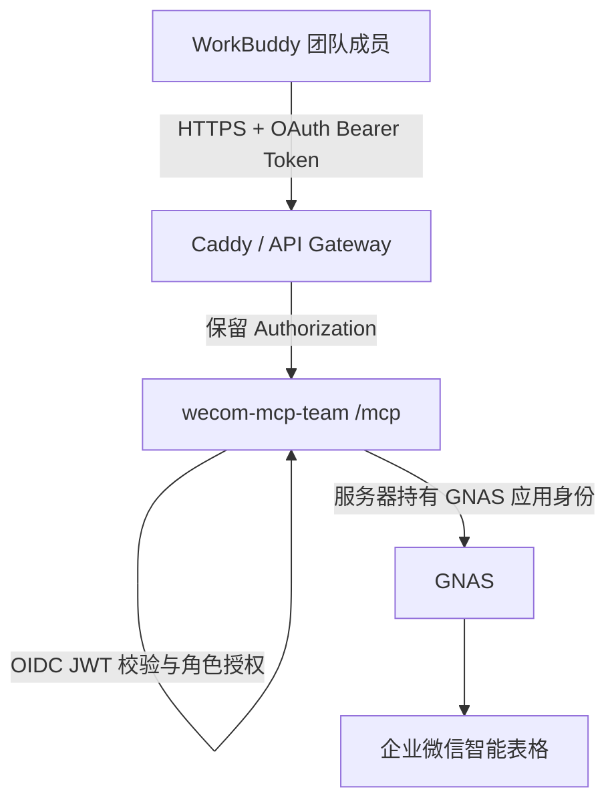

# 国脉爱特团队 MCP 服务器

本模块把现有固定租户企业微信业务层发布为团队可共享的 Streamable HTTP MCP，同时保留仓库根模块原有的 stdio 二进制和 Go 1.23 构建契约。团队服务器使用 Go 1.25 和官方 MCP Go SDK，不改变客户端本地安装器。

## 边界



- 团队成员身份来自组织 OIDC，MCP 不接受客户端自报的用户或角色。
- 国脉爱特的 `GNAS_APP_ID` / `GNAS_APP_SECRET` 只存在于服务器 Secret 或受保护环境文件。
- `reader`、`operator`、`admin` 角色逐层继承；`tools/list` 只展示已授权工具，`tools/call` 再次校验。
- 现有固定租户、API 白名单、Schema、幂等、写后回读和初始化恢复门禁仍是最终业务边界。
- 审计日志只记录请求 ID、角色、工具、结果、耗时和 HMAC 密钥化的主体假名，不记录 Token、Secret、业务参数或响应内容；审计密钥按 PII/Secret 管理。
- 应用层默认最多同时执行 16 个业务工具调用，可通过受控配置调低或调高；公网速率限制仍由组织 API Gateway/WAF 提供。

## HTTP 端点

| 端点 | 认证 | 用途 |
| --- | --- | --- |
| `POST /mcp` | OIDC Bearer Token | 官方 Streamable HTTP MCP；JSON 或客户端声明的标准响应 |
| `GET /.well-known/oauth-protected-resource` | 无 | RFC 9728 OAuth 资源发现，供 WorkBuddy 发起 OAuth |
| `GET /healthz` | 无 | 进程存活检查，不访问 GNAS |
| `GET /readyz` | 无 | 实例配置、Schema 和 GNAS 环境结构检查；不访问远端或返回租户信息 |

生产只应通过 HTTPS 反向代理暴露。进程默认监听 `127.0.0.1:17801`；非回环监听必须显式设置 `TEAM_MCP_BEHIND_TLS_PROXY=true`。

## OIDC 约定

OIDC 访问令牌必须满足：

- 签名、签发方、有效期由 OIDC discovery/JWKS 校验；
- `aud` 包含 `TEAM_MCP_OIDC_AUDIENCE`；
- 稳定、非空的 `sub` 用于成员审计；
- `TEAM_MCP_ACCESS_TOKEN_CLAIM` 必须精确包含 `TEAM_MCP_ACCESS_TOKEN_VALUE`，用来区分 access token 与 ID token；
- `TEAM_MCP_ROLES_CLAIM` 指定的 claim 至少包含一个已配置角色；
- 可选 `TEAM_MCP_REQUIRED_SCOPES` 全部存在。

默认角色值：

| OIDC 角色 | MCP 角色 | 能力 |
| --- | --- | --- |
| `wecom-mcp-reader` | reader | 查询记录、Schema/初始化状态等只读工具 |
| `wecom-mcp-operator` | operator | reader + 受控记录写入和进度重算 |
| `wecom-mcp-admin` | admin | 全部工具，包括初始化、Schema 迁移和通用受管 API |

角色和 access-token 类型 claim 支持点路径，例如 `realm_access.roles`。OIDC 提供方必须签发 JWT access token，并提供标准 discovery/JWKS；部署前必须按该 IdP 的真实 access-token claim 设置 discriminator。ID token、本地自签共享 Token、空 `sub` 均默认拒绝。

## 本地构建与测试

根模块仍使用 Go 1.23，团队模块单独使用 Go 1.25：

```sh
go test ./...

cd teamserver
go test ./...
go test -race ./...
go vet ./...
go build ./cmd/wecom-mcp-team
```

容器从仓库根目录构建，以便同时读取根模块业务代码：

```sh
docker build -f teamserver/Dockerfile -t wecom-mcp-team:local .
```

## 服务器部署

1. 创建专用系统用户 `wecom-mcp`。每个不可变版本放入 `/opt/wecom-mcp/releases/<version>/wecom-mcp-team`，`/opt/wecom-mcp/current` 仅作为指向当前版本的原子符号链接。
2. 将实例配置、Schema 镜像和状态目录放入 `/var/lib/wecom-mcp/`，权限仅授予专用用户。实例配置中的绝对路径必须对应服务器真实路径；其中 `schema_admin_user` 必须受控更新为服务器进程用户 `wecom-mcp`，否则 Schema/初始化管理工具会继续 fail closed。OIDC admin 不替代这一 OS 身份门禁。更新前保留配置备份，并通过同目录临时文件原子替换。
3. 将 `deploy/teamserver.env.example` 复制到 `/etc/wecom-mcp/teamserver.env`，权限设为 root 可读；通过服务器 Secret 管理注入真实 GNAS 值。
4. 将 `deploy/wecom-mcp-team.service.example` 审阅后安装为 systemd unit。
5. 使用 `deploy/Caddyfile.example` 提供域名和 TLS；该示例本身不提供速率限制，公网部署必须再接组织 API Gateway/WAF 的限流能力。代理必须保留 `Authorization`。Caddy 示例把上游 `Host` 改为 loopback upstream，以保留官方 SDK 的 DNS-rebinding 防护；不要删除该配置或直接关闭防护。
6. OIDC 管理员创建 audience 和三个团队角色，并为 WorkBuddy 注册 OAuth 客户端。回调 URL 必须使用 WorkBuddy 当前界面/文档实际展示的值，不在部署脚本中猜测。
7. 先验证 `/healthz`、`/readyz` 和未认证 `/mcp` 的 `401 + WWW-Authenticate`，再执行 OAuth 登录、`initialize`、`tools/list` 和一个只读工具调用。

systemd 示例允许程序原子更新 `/var/lib/wecom-mcp` 下的受控配置、Schema generation 和 journal；不会授予源码目录或用户主目录写权限。仓库根 `.dockerignore` 使用构建白名单，Dockerfile 也只复制编译所需源码，避免把本地配置、`.env`、journal、备份或 Git 历史发送进构建层。

## WorkBuddy 配置

优先在 WorkBuddy 的团队 MCP 管理界面添加远程 MCP：

```json
{
  "mcpServers": {
    "guomai-aite-wecom": {
      "type": "http",
      "url": "https://mcp.example.com/mcp"
    }
  }
}
```

不要在配置中填写 GNAS Secret。WorkBuddy 首次连接收到 OAuth 资源发现挑战后，应跳转组织登录；登录后由 WorkBuddy 保存自己的 OAuth Token。腾讯云 MCP 市场模板可能显示 `transportType: "streamable-http"`；WorkBuddy 当前 HTTP 配置契约使用 `type: "http"`。不同 WorkBuddy 版本若使用 UI 而非 JSON，以该版本官方界面生成的配置为准，不直接覆盖内部文件。

## 验收层级

必须分别报告：

```ini
built=yes|no
server_installed=yes|no
server_configured=yes|no
https_reachable=yes|no
oauth_verified=yes|no
loaded=yes|no
role_filter_verified=yes|no
registry_verified=yes|no
nine_tables_verified=yes|no
schema_synced=yes|no
tools_call_verified=yes|no
workbuddy_verified=yes|no
owner_accepted=no
production_deployed=no
```

本地测试、容器构建或 HTTP 200 不能替代真实 WorkBuddy OAuth 登录和固定租户只读调用。

## 回滚

- 保留上一个 `/opt/wecom-mcp/releases/<version>/` 不可变二进制/镜像及其校验和。
- 回滚只切换程序版本，不覆盖实例配置、Schema、journal 或 GNAS 凭据。
- 在 Linux 上创建指向目标 release 的 `current.next` 链接，再以同一文件系统内的原子 rename 替换 `/opt/wecom-mcp/current`，随后 `systemctl restart wecom-mcp-team`；不要原地覆盖正在运行的二进制。
- 切换后依次回读 `/healthz`、`/readyz`、OAuth、`initialize`、角色化 `tools/list` 和只读工具。
- 未确认的企业微信远程写入按现有 journal/sentinel 恢复，禁止因程序回滚而盲目重放。

## 参考

- [WorkBuddy MCP Integration](https://www.workbuddy.ai/docs/workbuddy/From-Beginner-to-Expert-Guide/Function-Description/MCP-Guide)
- [WorkBuddy Enterprise MCP 配置](https://cloud.tencent.com/document/product/1831/137039)
- [MCP 官方 Go SDK](https://github.com/modelcontextprotocol/go-sdk)
