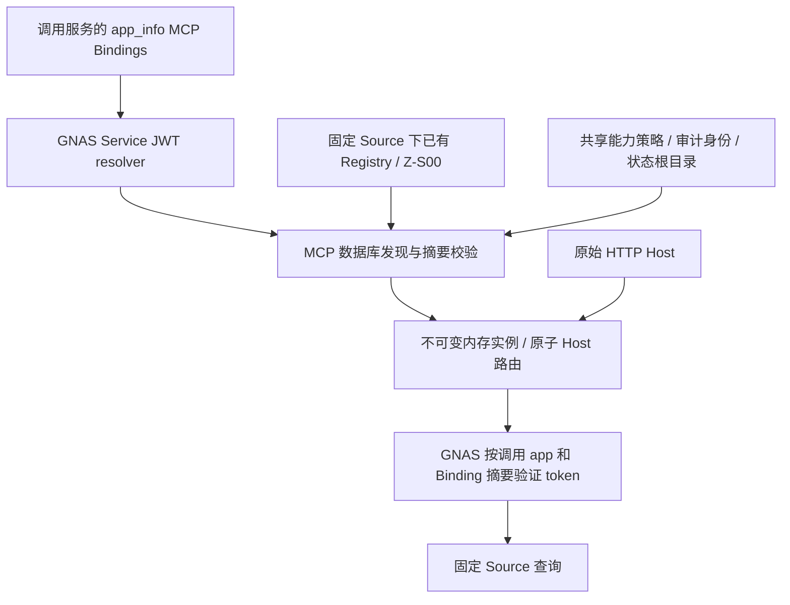

# GNAS 数据库多实例发现：双仓候选与发布审核

日期：2026-09-23。仅本地实现、fake 测试和代码审查；未读生产明文密钥、未写生产数据库、未修改 Nginx、未发布或重启生产。

## 根因及证据边界

基线 MCP `4cfd3a3` 支持 `--config`、`--fleet`、`--gnas-fleet-runtime`。第三种模式通过 Service JWT 调用 `POST /gnas/service/resolveMCPBindingsV1`，但仍把每个数据库 Binding 与本地 runtime manifest 对接，取实例路径和独立 OAuth introspection 客户端密钥引用。HostRouter 只在启动时构建。不存在“打开已有 DB-only 参数即可解决”的隐藏开关。

日期化文件路径不是代码常量。移交现场所述 `/home/product/services/mcp/wecom/instances/gmzoop/config/fleet-runtime-20260916.json` 是部署选择；其只含旧企业、尖品客 Host 返回 421，与代码链路一致。不能仅由文件存在确定当前生效 ExecStart 模式；本轮没有重新访问生产服务、数据库或 systemd。线上二进制及启动参数仍需发布前只读核验。

GNAS 本地基线 `02956aa` 的 `MCPBindings.go` 从调用服务应用的 `app_info.config.mcp_bindings` 读取记录并校验 managed Source 权限；`OAuth21HTTP.go` 的标准 introspection 只接受逐租户 Basic 客户端；`OAuth21BindingFleet.go` 在启动时构建 OAuth Host centers。故原系统要求数据库与本地文件双重配置，且两端均缺少完整动态发现链路。

## 最终候选范围

| 仓库 | 分支 | 变更 |
| --- | --- | --- |
| wecom-mcp | `codex/gnas-fleet-discovery`，基线 `4cfd3a3` | 数据库发现、内存固定实例、共享能力策略、周期刷新、Service JWT introspection 客户端、metadata 路径修复 |
| ginkgoto-ai | `codex/mcp-binding-discovery`，基线 `02956aa` | 服务身份 introspection 接口、Binding 摘要比对、OAuth Host 安全刷新、企业身份代际校验 |

MCP 的初始热刷新实现复用了已有 `codex/gnas-fleet-refresh` 工作树的未提交候选，在本任务独立 worktree 中扩展；原工作树及其文件未修改。两仓最终提交、制品哈希和本轮测试结果见同目录 `GNAS-FLEET-VALIDATION.md`，不以旧工作树的证据冒充本次结果。

### 配置权威

- 数据库 Binding 是租户名单、Host、Source、authorization resource、Registry 的唯一配置权威；MCP 不直接连接 MongoDB、不取得企业微信 Secret。
- 新参数 `--gnas-discovery-policy <absolute-policy> --gnas-state-root <canonical-existing-directory>`。policy 只有 `version` 和 `api_whitelist`，不接受租户字段。监听、服务身份、审计密钥仍属于部署参数。
- 根据固定 Registry Key 找到唯一 active Registry，再完整分页读取 Z-S00，核验实例名、九角色 Schema 和摘要。既有实例名可以不同于 Binding ID；不创建表、修复 Schema 或选择 AI 执行主体。
- 实例配置仅存在内存；Store 复制可变白名单，固定一代配置。初始化及 Registry bootstrap 在任何网络操作之前拒绝。状态文件名由单 Binding SHA-256 派生，Source/Registry/授权资源变更不复用旧身份日志。
- DB 删除后路由消失；正确摘要的空数组会撤下全部租户，随后可以自动重新发现。null、传输错误、权限错误和摘要错误均不解释为空配置。
- 默认 30 秒串行刷新，可设最短 5 秒。首次读取失败退出；刷新失败使全部已知 Host 返回 503，未知 Host 返回 421，成功后恢复。有变化时先停止新请求，最多排空 10 秒再原子切换；未变化服务复用。刷新本身有 10 秒时限，首次发现有 30 秒时限，超时失败关闭并重试。
- 本地 runtime manifest 热刷新模式仍保留兼容，不是推荐的自动发现入口；清理其中已移除租户文件前须同步清理本地映射，否则仍会验证文件存在。

### 认证契约及两端刷新一致性

新项目专用接口：`POST /gnas/service/introspectMCPTokenV1`，Service JWT 认证，JSON 请求含 `binding_id`、`binding_digest`、`token`。返回 `code=200` 和 `data`（active、issuer、audience、tenant、员工及工具权限）。不回退到共享 Basic client。此接口是项目内部 JSON 协议，不宣称它是标准 RFC 7662 form 请求；复用 [RFC 7662](https://www.rfc-editor.org/info/rfc7662/) 的活动状态及授权上下文语义。外部 MCP OAuth 仍遵循 [MCP 授权发现规范](https://modelcontextprotocol.io/specification/2025-11-25/basic/authorization)。

`binding_digest` 为单个 Binding 按两仓 Go struct 字段顺序 JSON 编码的 SHA-256，覆盖 binding_id、public_resource、authorization_resource、source、plugins/zoop。它不含密钥，也不是数字签名；真实性来自受认证连接。GNAS 每次从调用者 app 读取 Binding 并精确比对摘要。即使新旧配置的 Host/tenant/audience 相同，MCP 旧 Source 快照也不能接受新 Source token。

GNAS 新刷新开关为 `GNAS_OAUTH21_MCP_BINDING_REFRESH_ENABLED=true`；请求触发、30 秒窗口。到期会重新核对 Binding 及 CorpID/AgentID 元数据，完整成功后替换中心；失败关闭，不在控制面失败时无限使用旧配置。新 Binding 在既有 DCR 或 CIMD 策略已启用时不要求另配逐租户 Basic 资源服务器客户端，客户端注册、员工和实时权限规则继续生效。

GNAS 还把 Binding/企业元数据指纹绑定到现有不透明授权状态和 token 生命周期，防止同名 Binding 或 Source 改指向后复用旧授权。详情和二进制回滚注意事项以配套 GNAS `gnas-service-gin/docs/mcp-binding-discovery.md` 为准（不新增数据库字段）。

### 当前能力边界：必须纳入发布取舍

**当前数据库发现模式提供查询，不是既有写入实例的功能等价替换。** Binding 契约没有 AI 执行主体、schema admin 或本地 operator，不能猜测或继承另一个企业的主体。新模式只列出 reader 工具，并始终保留 GNAS 每人实时权限与 API 白名单；初始化、结构修改、消息发送及业务写入不开放。

若共享服务的既有企业仍需要写工具，不得直接把整个生产共享进程切换到本候选。先形成线上能力清单，确认本次发布仅接受查询能力；需要保留写入时，应保持旧模式运行，继续设计在线执行主体绑定的配套工作。本任务没有通过“选取唯一看似可用的 AI 主体”绕开该边界。

新增租户还须已具备完整可读的 Registry/Z-S00、有效的 Source 与企业微信凭据、服务应用权限，以及可用的 OAuth 客户端注册/metadata 策略。单个租户的缺项会使整个刷新失败并 503，这是本候选的保守故障策略。表中存在配置记录不等于这些条件已验收。

## 尖品客数据库配置是否足够

- 对旧生产版本：不够，仍需要逐租户 runtime 清单和 OAuth 客户端配置。
- 对本候选的自动发现/查询：不再要求手工添加尖品客 fleet JSON、实例 JSON 或 OAuth Basic 密钥。已有 Binding/Source/凭据/Registry 若位于共享服务身份可访问的 app 中、权限匹配且 Registry/Z-S00 完整，即具备发现所需的租户配置。
- 现场消息只确认这些记录已存在。本轮没有只读核实其所在 app、权限、active Registry 完整性、GNAS 当前运行版本或客户端策略。因此不宣称尖品客已满足全部前置，也不宣称线上 421 已消失或尖品客已可用。
- 增加 Binding 通常无需重启已启用新版发现的 MCP/GNAS。切到新二进制、首次启用参数和更新进程环境仍需受控重启一次；Source/凭据管理自身的刷新周期仍按 GNAS 既有机制。

## 单独批准后的发布与启用顺序

以下为审查步骤，不是本轮已执行动作。生产安装由各仓库受控发布流程完成，不直接手改数据库、Nginx 或手工重启服务。

1. 只读预检实际二进制 SHA/revision、systemd 生效模式/参数、EnvironmentFile 路径、Source resolver 可见的 Binding 数量/摘要；不输出完整进程命令或环境内容。确认线上 GNAS/MCP 没有本地未集成补丁。
2. 核验每个企业需要的工具清单。若存在必须保持的写工具，本候选停留在隔离候选验收，不切共享生产。查询范围另获产品确认后才进入下面步骤。
3. 保留原二进制、服务 drop-in、受保护环境文件与旧 state/Schema；只记录校验和，不复制密钥进审核包。预建专用 canonical state 根目录及服务用户权限。`--check-config` 不创建本地租户文件或业务资产。
4. 先在隔离 GNAS 候选验证新增接口和开关，使用现有受保护服务身份；配对 MCP 候选只监听未占用 loopback 端口。参考 `wecom-mcp-gnas-discovery-policy.json.example` 和 `wecom-mcp-gnas-discovery.conf.example`，不要把示例端口直接当作候选端口。
5. MCP 运行 `wecom-mcp-team --gnas-discovery-policy <absolute-policy> --gnas-state-root <absolute-state-root> --listen 127.0.0.1:<candidate-port> --check-config`。这是 GNAS 与 Registry 的只读核验；失败即停止启用，不自动初始化缺失资产。
6. 全租户验收矩阵：原始 Host `/healthz`、`/readyz` 200；无 token `/mcp` 401 且 challenge metadata 可访问；未知 Host 421；伪造 X-Forwarded-Host 无效；跨企业 token 拒绝；有效用户 initialize、tools/list、Registry/Schema 和小范围查询通过。带相反 Source 的旧 Binding 摘要必须拒绝。
7. 仅在 fake/sandbox 数据源演练新增、移除、最后一项删除、Source/Registry 变更、坏摘要、控制面失联与恢复、排空超时。不得通过修改生产 Binding 做故障演练。确认监控不会对预期 503 进行无限重启。
8. 分别审批 GNAS 与 MCP 生产发布。先发布/启用 GNAS 配套能力，再切 MCP 的发现模式；按受控流程加载新二进制和进程参数。一次性安装不等于后续每新增租户都需要重启。
9. 重复全租户查询/授权矩阵并观察至少两个刷新周期，记录 UTC 时间、二进制 SHA、开关、Binding 摘要及结果。DNS/TLS/Nginx 按现场保持；若预检发现其与源码假设不符，应另行报告，不能在本任务顺手修改。

## 回滚

优先恢复 MCP 旧二进制、drop-in 和受保护运行依赖，保留 GNAS 新版认证保护；按已批准发布流程重启。旧模式如果缺少新增 Binding 的本地运行依赖，可能仍无法启动，所以回滚可启动性必须在切换前验证，不能承诺“恢复旧文件必然成功”。不删除新 Binding、Registry、Schema、state 或业务数据。

GNAS 回滚需区分“保留新版二进制关闭动态开关”和“恢复完全不理解代际 namespace 的旧二进制”。后者不能直接当作等价回滚；需按配套 GNAS 文档处理 token 生命周期/密钥或等待期，且任何生产密钥、会话处理都须另获授权。发现隔离失败、现有用户回归或持续刷新失败时停止切换，保留候选和脱敏诊断证据，不盲目循环重启。

## 状态标签

本地代码、测试、独立审查、Git 提交、合并、生产发布、开关启用、真实客户端/Owner 验收分别记录。最终验证报告只证明本地候选；未发布、未启用、未验证尖品客线上可用。相关待验收条件不会因为本地测试通过而自动关闭。
