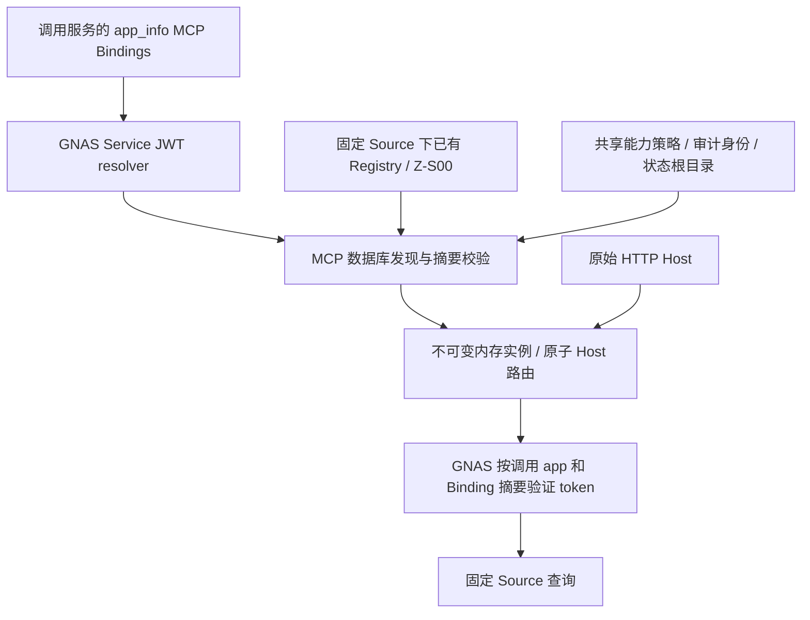

# GNAS 数据库多实例发现：双仓候选与发布审核

日期：2026-09-23。已完成混合模式实现、fake/HTTP/race 验证及生产只读基线检查；配对 GNAS 已合并并暂存候选。未写生产数据库、未修改 Nginx、未切换或重启生产。

## 根因及证据边界

基线 MCP `4cfd3a3` 支持 `--config`、`--fleet`、`--gnas-fleet-runtime`。第三种模式通过 Service JWT 调用 `POST /gnas/service/resolveMCPBindingsV1`，但仍把每个数据库 Binding 与本地 runtime manifest 对接，取实例路径和独立 OAuth introspection 客户端密钥引用。HostRouter 只在启动时构建。不存在“打开已有 DB-only 参数即可解决”的隐藏开关。

日期化文件路径不是代码常量。移交现场所述 `/home/product/services/mcp/wecom/instances/gmzoop/config/fleet-runtime-20260916.json` 是部署选择；其只含旧企业、尖品客 Host 返回 421，与代码链路一致。本轮已只读核验实际进程和 systemd：运行 `20260916T073038Z-4cfd3a3`，current 链接与实际进程不同；精确基线与控制器流程见 [生产发布说明](production/README.md)。

GNAS 本地基线 `02956aa` 的 `MCPBindings.go` 从调用服务应用的 `app_info.config.mcp_bindings` 读取记录并校验 managed Source 权限；`OAuth21HTTP.go` 的标准 introspection 只接受逐租户 Basic 客户端；`OAuth21BindingFleet.go` 在启动时构建 OAuth Host centers。故原系统要求数据库与本地文件双重配置，且两端均缺少完整动态发现链路。

## 最终候选范围

| 仓库 | 分支 | 变更 |
| --- | --- | --- |
| wecom-mcp | `codex/gnas-fleet-discovery`，基线 `4cfd3a3` | 混合静态完整实例与动态只读实例、完整配置摘要绑定、周期刷新、Service JWT introspection、metadata 及受控发布资产 |
| ginkgoto-ai | MR !41 已合并为 `96e4add1ffde8c8716b26b1f4f1465ef37c3dc47` | 服务身份 introspection 接口、Binding 摘要比对、OAuth Host 安全刷新、企业身份代际校验 |

MCP 的初始热刷新实现复用了已有 `codex/gnas-fleet-refresh` 工作树的未提交候选，在本任务独立 worktree 中扩展；原工作树及其文件未修改。两仓最终提交、制品哈希和本轮测试结果见同目录 `GNAS-FLEET-VALIDATION.md`，不以旧工作树的证据冒充本次结果。

### 配置权威

- 数据库 Binding 是租户名单、Host、Source、authorization resource、Registry 的唯一配置权威；MCP 不直接连接 MongoDB、不取得企业微信 Secret。
- 新参数 `--gnas-discovery-policy <absolute-policy> --gnas-state-root <canonical-existing-directory>`。policy 只有 `version` 和 `api_whitelist`，不接受租户字段。监听、服务身份、审计密钥仍属于部署参数。
- 根据固定 Registry Key 找到唯一 active Registry，再完整分页读取 Z-S00，核验实例名、九角色 Schema 和摘要。既有实例名可以不同于 Binding ID；不创建表、修复 Schema 或选择 AI 执行主体。
- 未映射动态实例配置仅存在内存；Store 复制可变白名单，固定一代配置。初始化及 Registry bootstrap 在任何网络操作之前拒绝。状态文件名由单 Binding SHA-256 派生，Source/Registry/授权资源变更不复用旧身份日志。
- DB 删除后路由消失；正确摘要的空数组会撤下全部租户，随后可以自动重新发现。null、传输错误、权限错误和摘要错误均不解释为空配置。
- 默认 30 秒串行刷新，可设最短 5 秒。首次读取失败退出；刷新失败使全部已知 Host 返回 503，未知 Host 返回 421，成功后恢复。有变化时先停止新请求，最多排空 10 秒再原子切换；未变化服务复用。刷新本身有 10 秒时限，首次发现有 30 秒时限，超时失败关闭并重试。
- 本地 runtime manifest 热刷新模式仍保留兼容，不是推荐的自动发现入口；清理其中已移除租户文件前须同步清理本地映射，否则仍会验证文件存在。

### 认证契约及两端刷新一致性

新项目专用接口：`POST /gnas/service/introspectMCPTokenV1`，Service JWT 认证，JSON 请求含 `binding_id`、`binding_digest`、`token`。返回 `code=200` 和 `data`（active、issuer、audience、tenant、员工及工具权限）。不回退到共享 Basic client。此接口是项目内部 JSON 协议，不宣称它是标准 RFC 7662 form 请求；复用 [RFC 7662](https://www.rfc-editor.org/info/rfc7662/) 的活动状态及授权上下文语义。外部 MCP OAuth 仍遵循 [MCP 授权发现规范](https://modelcontextprotocol.io/specification/2025-11-25/basic/authorization)。

`binding_digest` 为单个 Binding 按两仓 Go struct 字段顺序 JSON 编码的 SHA-256，覆盖 binding_id、public_resource、authorization_resource、source、plugins/zoop。它不含密钥，也不是数字签名；真实性来自受认证连接。GNAS 每次从调用者 app 读取 Binding 并精确比对摘要。即使新旧配置的 Host/tenant/audience 相同，MCP 旧 Source 快照也不能接受新 Source token。

GNAS 新刷新开关为 `GNAS_OAUTH21_MCP_BINDING_REFRESH_ENABLED=true`；请求触发、30 秒窗口。到期会重新核对 Binding 及 CorpID/AgentID 元数据，完整成功后替换中心；失败关闭，不在控制面失败时无限使用旧配置。新 Binding 在既有 DCR 或 CIMD 策略已启用时不要求另配逐租户 Basic 资源服务器客户端，客户端注册、员工和实时权限规则继续生效。

GNAS 还把 Binding/企业元数据指纹绑定到现有不透明授权状态和 token 生命周期，防止同名 Binding 或 Source 改指向后复用旧授权。详情和二进制回滚注意事项以配套 GNAS `gnas-service-gin/docs/mcp-binding-discovery.md` 为准（不新增数据库字段）。

### 混合模式保留已有能力

同时使用 `--gnas-fleet-runtime` 与 `--gnas-discovery-policy`：一次完整 GNAS payload 决定租户路由，已映射 Binding 使用受保护本地配置，保留原完整写入、消息、初始化、schema 管理工具，以及 operator/AI 执行主体、schema/state 路径；未映射实例从 Registry/Z-S00 发现，只发布 reader 工具。两者均使用单 Binding digest 的 Service JWT 认证和员工实时权限。

静态配置绑定完整内容摘要，每次 Store 读取与工具执行重新校验，外部漂移立即拒绝；合法内部初始化写回在同 Store 更新摘要。静态文件缺失、Source/Registry 不符时拒绝，不自动降为只读。重复 ID/Host/Source、实例名或存储路径冲突、symlink 别名全部拒绝。DB 删除静态或动态 Binding 均撤路由。单项错误使完整 refresh 失败，已知 Host503、未知421，成功后原子恢复；不把旧权限持续服务称为恢复。

新增租户还须已具备完整可读的 Registry/Z-S00、有效的 Source 与企业微信凭据、服务应用权限，以及可用的 OAuth 客户端注册/metadata 策略。单个租户的缺项会使整个刷新失败并 503，这是本候选的保守故障策略。表中存在配置记录不等于这些条件已验收。

## 尖品客数据库配置是否足够

- 对旧生产版本：不够，仍需要逐租户 runtime 清单和 OAuth 客户端配置。
- 对本候选的自动发现/查询：不再要求手工添加尖品客 fleet JSON、实例 JSON 或 OAuth Basic 密钥。已有 Binding/Source/凭据/Registry 若位于共享服务身份可访问的 app 中、权限匹配且 Registry/Z-S00 完整，即具备发现所需的租户配置。
- 现场消息只确认这些记录已存在。本轮没有只读核实其所在 app、权限、active Registry 完整性、GNAS 当前运行版本或客户端策略。因此不宣称尖品客已满足全部前置，也不宣称线上 421 已消失或尖品客已可用。
- 增加 Binding 通常无需重启已启用新版发现的 MCP/GNAS。切到新二进制、首次启用参数和更新进程环境仍需受控重启一次；Source/凭据管理自身的刷新周期仍按 GNAS 既有机制。当前 Source 缓存窗口为 60 秒，加上 fleet 的 30 秒检查窗口，新增 Source 最坏可能约 90 秒后可用；该期间配置尚未对齐会失败关闭。

## 单独批准后的发布与启用顺序

以 [已纳入仓库的混合模式生产控制器说明](production/README.md) 为唯一执行入口。流程区分 MCP 基础设施安装、GNAS 二进制切换、GNAS 功能启用和 MCP 业务切换，各自满足精确批准和依赖门禁。禁止使用旧测试部署示例直接改 systemd/current 或旁路启动生产配置实例。

候选与同提交 CI、独立 Verifier/Reviewer 通过后，管理员分别签发安装和业务 receipt。GNAS 配对候选先暂存，MCP 兼容门禁通过才可切 GNAS。MCP 必须保留 gmzoop 全能力，增加尖品客只读；先通过旧二进制只读可启动检查，再由控制器切换并完成双域名 HTTP/OAuth 合同与五分钟观察。真实员工身份和 Owner 验收单列，不能用 fake 测试或无 token HTTP 状态替代。

## 回滚

优先恢复 MCP 旧二进制、drop-in 和受保护运行依赖，保留 GNAS 新版认证保护；按已批准发布流程重启。旧模式如果缺少新增 Binding 的本地运行依赖，可能仍无法启动，所以回滚可启动性必须在切换前验证，不能承诺“恢复旧文件必然成功”。不删除新 Binding、Registry、Schema、state 或业务数据。

GNAS 回滚需区分“保留新版二进制关闭动态开关”和“恢复完全不理解代际 namespace 的旧二进制”。后者不能直接当作等价回滚；需按配套 GNAS 文档处理 token 生命周期/密钥或等待期，且任何生产密钥、会话处理都须另获授权。发现隔离失败、现有用户回归或持续刷新失败时停止切换，保留候选和脱敏诊断证据，不盲目循环重启。

## 状态标签

本地代码、测试、独立审查、Git 提交、合并、生产发布、开关启用、真实客户端/Owner 验收分别记录。最终验证报告只证明本地候选；未发布、未启用、未验证尖品客线上可用。相关待验收条件不会因为本地测试通过而自动关闭。
